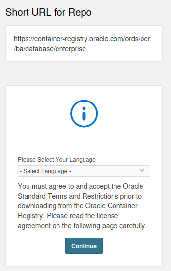
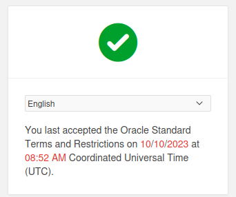

# Distributed databases using OracleDB

## Build Docker containers with OracleDB

### Connecting the local database with the remote one

```shell
sudo docker compose up -d
```

__Running the containers first time__ will cause <span style="color:red">__unauthorized error__</span>.

```shell
[+] Running 2/2
 ✘ serverpatients Error                                                    0.9s 
 ✘ servermanagement Error                                                  0.9s 
Error response from daemon: Head "https://container-registry.oracle.com/v2/database/enterprise/manifests/latest": unauthorized: authentication required
```

## Authenticating on container registry

1. [Signing](<https://login.oracle.com/mysso/signon.jsp>) or [create an account](https://profile.oracle.com/myprofile/account/create-account.jspx) at Oracle.com
2. If you signed up, verify your email
3. Go to [Database container derictory](https://container-registry.oracle.com/ords/f?p=113:4:117527266471116:::4:P4_REPOSITORY,AI_REPOSITORY,AI_REPOSITORY_NAME,P4_REPOSITORY_NAME,P4_EULA_ID,P4_BUSINESS_AREA_ID:9,9,Oracle%20Database%20Enterprise%20Edition,Oracle%20Database%20Enterprise%20Edition,1,0&cs=3iLUcCqamva-NxYGXjAd6IcmXka5TcQLIMPUr42OXZHaqLZz8CQewG-aAmnJtkDO6bKltfDPLr3zqnsTaNEdG4g)
4. Accept the terms and conditions
  [](./assets/image.png)
1. After you've done that, you should see
  [](./assets/image-1.png)
1. Open the terminal in the current project directory and run ```sudo docker login container-registry.oracle.com```
2. Open the terminal and run ```sudo docker pull container-registry.oracle.com/database/enterprise:latest```
3. You should see the message __"Login Succeeded"__

## Authentiacate to Docker

1. Go to [Docker hub](https://hub.docker.com/signup) and create an account
2. Then run

    ```shell
    sudo docker login
    ```

3. You should see the message __"Login Succeeded"__

## Compose the Docker containers

```shell
sudo docker compose up -d
```
