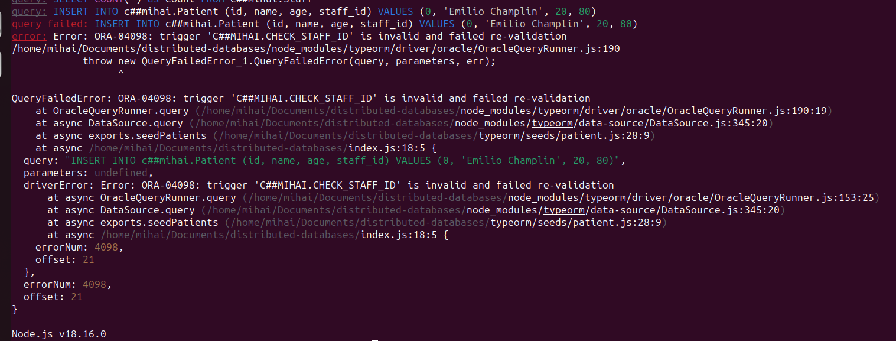
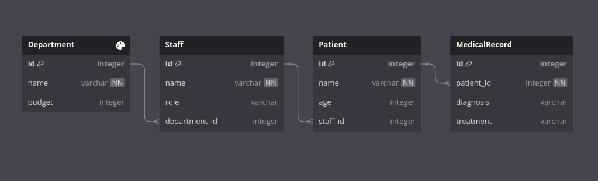
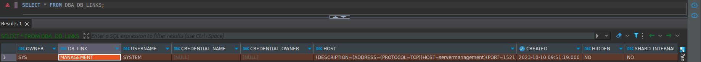
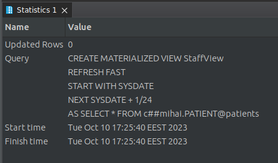
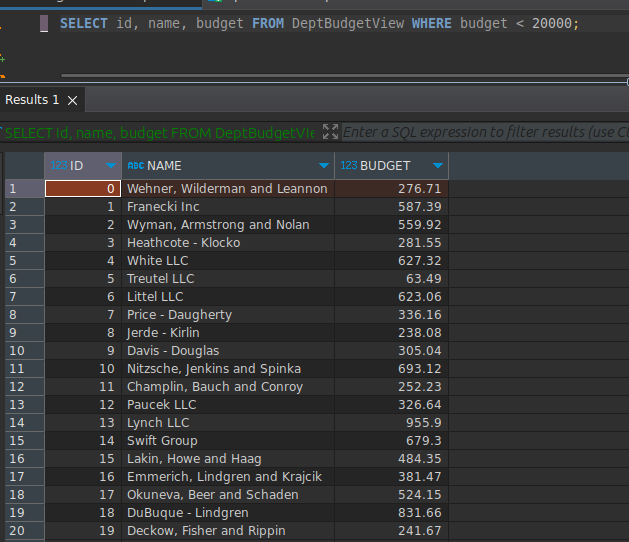
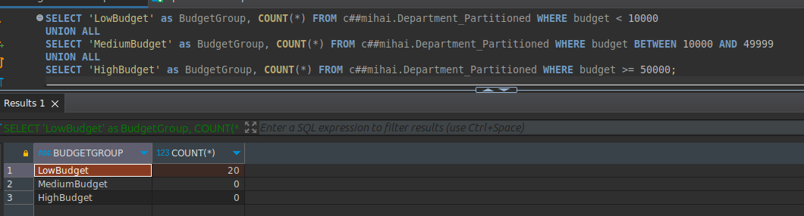
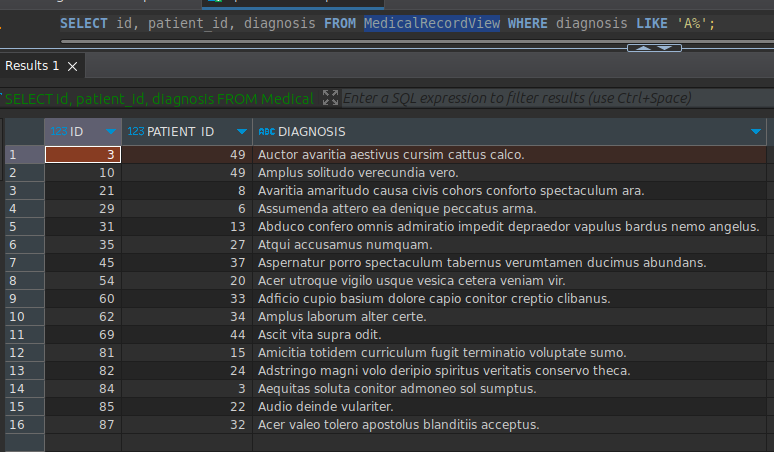
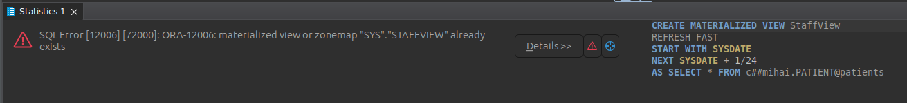
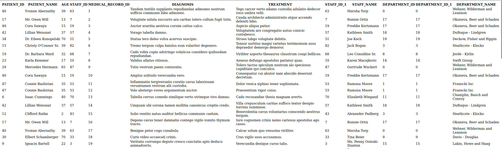

# Distributed Databases Using OracleDB

This documentation serves both as a guide and a report on setting up distributed databases using OracleDB within Docker containers. It aims to provide a step-by-step walkthrough for building the containers, establishing connections, and handling authentication, thereby aiding in the effective deployment and management of distributed Oracle databases.

## Table of Contents

- [Distributed Databases Using OracleDB](#distributed-databases-using-oracledb)
  - [Table of Contents](#table-of-contents)
  - [Build Docker Containers with OracleDB](#build-docker-containers-with-oracledb)
    - [Connecting the Local Database to the Remote One](#connecting-the-local-database-to-the-remote-one)
    - [Handling Unauthorized Errors](#handling-unauthorized-errors)
  - [Authenticating on Container Registry](#authenticating-on-container-registry)
  - [Authenticate to Docker](#authenticate-to-docker)
  - [Compose the Docker Containers](#compose-the-docker-containers)
    - [Docker Images Building](#docker-images-building)
    - [Access Databases Outside of Docker Container](#access-databases-outside-of-docker-container)
      - [Pre-requisites](#pre-requisites)
  - [Install Oracle Client Library on Ubuntu](#install-oracle-client-library-on-ubuntu)
  - [Resolve Connection Issues](#resolve-connection-issues)
    - [Dealing with `ORA-12526` Errors: Database in Restricted Mode](#dealing-with-ora-12526-errors-database-in-restricted-mode)
      - [Steps](#steps)
      - [Connect to the Management Database](#connect-to-the-management-database)
      - [Connect to the Patients Database](#connect-to-the-patients-database)
  - [Order of setup](#order-of-setup)
    - [Data Integrity](#data-integrity)
  - [Database Schema](#database-schema)
    - [Management DB](#management-db)
      - [Department Table](#department-table)
      - [Staff Table](#staff-table)
      - [**Foreign Key References**](#foreign-key-references)
    - [Patients DB](#patients-db)
      - [Patient Table](#patient-table)
      - [Medical Record Table](#medical-record-table)
      - [Foreign Key References](#foreign-key-references-1)
  - [ER Diagram](#er-diagram)
  - [Database Link Creation Documentation](#database-link-creation-documentation)
    - [Overview](#overview)
    - [1. Creating Database Links](#1-creating-database-links)
      - [Creating a Database Link Named 'patients'](#creating-a-database-link-named-patients)
      - [Creating a Database Link Named 'management'](#creating-a-database-link-named-management)
    - [2. Understanding Database Link Parameters](#2-understanding-database-link-parameters)
    - [3. Testing Database Links](#3-testing-database-links)
      - [DBLink query result example](#dblink-query-result-example)
  - [Creating Synonyms](#creating-synonyms)
  - [1. Creating Synonyms](#1-creating-synonyms)
    - [Creating a Synonym for the 'Patient' Table](#creating-a-synonym-for-the-patient-table)
    - [Creating Synonyms for 'Department' and 'Staff' Tables](#creating-synonyms-for-department-and-staff-tables)
  - [2. Usage of Synonyms](#2-usage-of-synonyms)
    - [Querying the 'Patient' Table Using the 'patient' Synonym](#querying-the-patient-table-using-the-patient-synonym)
    - [Querying the 'Staff' Table Using the 'staff' Synonym](#querying-the-staff-table-using-the-staff-synonym)
  - [3. Benefits of Synonyms](#3-benefits-of-synonyms)
  - [Creating Materialized Views](#creating-materialized-views)
    - [Procedure](#procedure)
  - [Understanding the Process](#understanding-the-process)
    - [Refresh Methods](#refresh-methods)
  - [Partitioning](#partitioning)
    - [Horizontal Partitioning with OracleDB](#horizontal-partitioning-with-oracledb)
      - [SQL for Populating `Department_Partitioned`](#sql-for-populating-department_partitioned)
      - [Query for Budget-Based Partition Count](#query-for-budget-based-partition-count)
    - [View-Based Partitioning for Medical Records](#view-based-partitioning-for-medical-records)
    - [Showcasing the fact that the view has been succesfully created](#showcasing-the-fact-that-the-view-has-been-succesfully-created)
  - [UI showing the data from both databases](#ui-showing-the-data-from-both-databases)

---

## Build Docker Containers with OracleDB

### Connecting the Local Database to the Remote One

To set up the connection, run the following command:

```bash
sudo docker-compose up -d
```

:exclamation: **Note**: Running the containers for the first time may lead to an unauthorized error:

```bash
Error response from daemon: unauthorized: authentication required
```

### Handling Unauthorized Errors

If you encounter the above error, it's likely because you need to authenticate. Follow the steps in the next section for guidance.

---

## Authenticating on Container Registry

1. [Sign in](https://login.oracle.com/mysso/signon.jsp) or [create an account](https://profile.oracle.com/myprofile/account/create-account.jspx) on Oracle.com.
2. Verify your email if you just signed up.
3. Navigate to the [Database Container Directory](https://container-registry.oracle.com/ords/f?p=113:4:::NO:4:P4_REPOSITORY,AI_REPOSITORY,AI_REPOSITORY_NAME,P4_REPOSITORY_NAME,P4_EULA_ID,P4_BUSINESS_AREA_ID::).
4. Accept the terms and conditions. [See Image](./assets/image.png)
5. After accepting, you should see the following screen. [See Image](./assets/image-1.png)
6. Open a terminal in the project directory and run:

    ```bash
    sudo docker login container-registry.oracle.com
    ```

7. Pull the OracleDB image:

    ```bash
    sudo docker pull container-registry.oracle.com/database/enterprise:latest
    ```

8. You should see the message **"Login Succeeded"**.

---

## Authenticate to Docker

1. Create an account on [Docker Hub](https://hub.docker.com/signup).
2. Open a terminal and run:

    ```bash
    sudo docker login
    ```

3. Log in using your Docker Hub credentials.
4. You should see the message **"Login Succeeded"**.

---

## Compose the Docker Containers

To bring up the Docker containers, run the following command:

```bash
sudo docker-compose up -d
```

### Docker Images Building

Below is an image illustrating the process of Docker composing:


### Access Databases Outside of Docker Container

In this guide, we'll use **DBeaver** as an example to demonstrate how to connect to Oracle databases running in Docker containers.

#### Pre-requisites

- Two running containers: one for the management database listening on port 7090, and another for the patients database listening on port 7091 (as configured in your `docker-compose` file).

## Install Oracle Client Library on Ubuntu

You must have 64-bit Oracle Client libraries configured with ldconfig, or in LD_LIBRARY_PATH.
If you do not have Oracle Database on this computer, then install the Instant Client Basic or Basic Light package from
<https://www.oracle.com/database/technologies/instant-client/linux-x86-64-downloads.html>

1. **Download Instant Client Zip File**:
  Download `instantclient-basic-linux.x64-21.11.0.0.0dbru.zip` from the [Oracle website](https://www.oracle.com/database/technologies/instant-client/linux-x86-64-downloads.html).

2. **Unzip the File**:
  Extract the contents of the zip file into a directory of your choice. For example, you might create a directory called `/opt/oracle/` and unzip the package there:

    ```bash
    mkdir -p /opt/oracle
    unzip instantclient-basic-linux.x64-21.11.0.0.0dbru.zip -d /opt/oracle
    ```

3. Install Libaio1

    ```shell
    sudo apt-get update
    sudo apt-get install libaio1 libaio-dev
    ```

4. **Environment Variables**:
  Add the client library to the `LD_LIBRARY_PATH`:

    ```bash
    export LD_LIBRARY_PATH=/opt/oracle/instantclient_21_11:$LD_LIBRARY_PATH
    ```

    It's often beneficial to put this line in your `.bashrc`, `.zshrc`, or `.profile` file to make it permanent.

5. **Create Symbolic Links**:
  Some applications may expect to find shared libraries in `/usr/lib`, so you might need to create symbolic links:

    ```bash
    sudo ln -s /opt/oracle/instantclient_21_11/libclntsh.so.21.1 /usr/lib/libclntsh.so
    sudo ln -s /opt/oracle/instantclient_21_11/libocci.so.21.1 /usr/lib/libocci.so
    ```

## Resolve Connection Issues

### Dealing with `ORA-12526` Errors: Database in Restricted Mode

If you encounter the error `ORA-12526, TNS:listener: all appropriate instances are in restricted mode`, it means that the Oracle database instance you're trying to connect to is in `RESTRICTED` mode. Follow the steps below to disable this mode:

1. **Connect to the Docker Container**
   - Execute the following command to connect to the Docker container where your Oracle instance is running:

     ```bash
     sudo docker exec -it <container_name> bash
     ```

     For example, to connect to the `distributed-databases-servermanagement-1` container, run:

     ```bash
     sudo docker exec -it distributed-databases-servermanagement-1 bash
     ```

     Similarly, to connect to the `distributed-databases-serverpatients-1` container, execute:

     ```bash
     sudo docker exec -it distributed-databases-serverpatients-1 bash
     ```

2. **Connect to SQL*Plus**
   - Use SQL*Plus to connect to the database as an admin:

     ```bash
     sqlplus / as sysdba
     ```

3. **Check Instance Status**
   - Run the following SQL query to check the status:

     ```sql
     SELECT INSTANCE_NAME, STATUS FROM V$INSTANCE;
     ```

4. **Startup the Database**
   - If the instance is down, start it up:

     ```sql
     STARTUP
     ```

   - If the database is in restricted mode, disable it:

     ```sql
     ALTER SYSTEM DISABLE RESTRICTED SESSION;
     ```

5. **Exit SQL Plus**
   - To exit SQL*Plus, type:

     ```sql
     EXIT;
     ```

6. **Restart the Listener**
   - To apply changes, restart the listener:

     ```bash
     lsnrctl stop
     lsnrctl start
     ```

7. **Check Listener Status**
   - Run `lsnrctl status` to ensure that the instance is now unrestricted.

8. **Test the Connection**
   - Use your client tool, such as DBeaver, to test the connection.

This should resolve the `ORA-12526` issue, allowing for successful connections.

#### Steps

1. **Launch DBeaver**
   - Start the DBeaver application.

2. **Create a New Connection**
   [Create New Connection Image](./assets/dbeaver-new-connection.png)

3. **Select Oracle Database**
   [Select Oracle Database Image](./assets/dbeaver-oracle-db.png)

---

#### Connect to the Management Database

1. **Host**: `localhost`
2. **Database (Service Name)**: `management`
3. **Port**: `7090`
4. **Username**: Enter `sys` and set the role to `SYSDBA`
   [Set Role to SYSDBA Image](./assets/dbeaver-role-sysdba.png)
5. **Password**: `Master2023`
6. **Test Connection**: Ensure everything is set up correctly.
7. **Finish**: Save the connection.

---

#### Connect to the Patients Database

1. **Host**: `localhost`
2. **Database (Service Name)**: `patients`
3. **Port**: `7091`
4. **Username**: Enter `sys` and set the role to `SYSDBA`
   [Set Role to SYSDBA Image](./assets/dbeaver-role-sysdba.png)
5. **Password**: `Master2023`
6. **Test Connection**: Ensure everything is set up correctly.
7. **Finish**: Save the connection.

## Order of setup

1. [Create user](./oracle-sql/create-user/)
2. [Create links](./oracle-sql/links/)
3. [Create synonyms](./oracle-sql/synonyms/)
4. [Run each migration](./oracle-sql/migrations/)
   1. [Department](./oracle-sql/migrations/management/Department.sql)
   2. [Staff](./oracle-sql/migrations/management/Staff.sql)
   3. [Patients](./oracle-sql/migrations/patients/Patient.sql)
   4. [Medical Record](./oracle-sql/migrations/patients/MedicalRecord.sql)
5. [Create materialized views](./oracle-sql/materialized-views/)

### Data Integrity

In Oracle triggers, the `:NEW` and `:OLD` pseudo-records are used to access the new and old values of the row's columns that are being inserted, updated, or deleted. In the case of an `INSERT` operation, `:NEW` will hold the new values being inserted into the row.

When you run the query:

```sql
INSERT INTO c##mihai.Patient (id, name, age, staff_id) VALUES (0, 'Randy Hudson', 56, 60);
```

The value for `:NEW.staff_id` in the trigger will be `60`, which is the value you are inserting for the `staff_id` column. The trigger will then use this value to look up the `staff` table to see if a staff member with `id = 60` exists.

If a staff member with `id = 60` exists, `count_staff` will be set to `1` and the insert operation will proceed. Otherwise, the trigger will raise an application error stating that a referential integrity violation has occurred.



[Link to data integrity SQL Example](./oracle-sql/data-integrity/CheckStaffId.sql)

## Database Schema

### Management DB

#### Department Table

```dbml
Table Department {
  id integer [primary key]
  name varchar [not null]
  budget integer
}
```

#### Staff Table

```dbml
Table Staff {
  id integer [primary key]
  name varchar [not null]
  role varchar
  department_id integer
}
```

#### **Foreign Key References**

  ```dbml
  Ref: Staff.department_id > Department.id // many-to-one
  ```

---

### Patients DB

#### Patient Table

```dbml
Table Patient {
  id integer [primary key]
  name varchar [not null]
  age integer
  staff_id integer
}
```

#### Medical Record Table

```dbml
Table MedicalRecord {
  id integer [primary key]
  patient_id integer [not null]
  diagnosis varchar
  treatment varchar
}
```

#### Foreign Key References

```dbml
Ref: MedicalRecord.patient_id > Patient.id // many-to-one
Ref: Patient.staff_id > Staff.id // many-to-one
```

## ER Diagram



## Database Link Creation Documentation

This documentation explains the process of creating database links in an Oracle database. Database links enable communication and access to remote databases, making it possible to query and manipulate data across different database instances.

### Overview

In this guide, we will cover:

1. Creating Database Links
2. Understanding Database Link Parameters
3. Testing Database Links

### 1. Creating Database Links

Database links are created using the `CREATE DATABASE LINK` statement in Oracle. Below are examples of creating two database links, 'patients' and 'management,' connecting to remote databases.

#### Creating a Database Link Named 'patients'

```sql
CREATE DATABASE LINK patients
CONNECT TO system IDENTIFIED BY Master2023
USING '(DESCRIPTION=(ADDRESS=(PROTOCOL=TCP)(HOST=serverpatients)(PORT=1521))(CONNECT_DATA=(SERVICE_NAME=patients)))';
```

- `patients`: Name of the database link.
- `system`: Username to connect to the remote database.
- `Master2023`: Password for the username.
- `serverpatients`: Hostname of the remote database server.
- `1521`: Port number for the database listener.
- `patients`: Service name or SID of the remote database.

#### Creating a Database Link Named 'management'

```sql
CREATE DATABASE LINK management
CONNECT TO system IDENTIFIED BY Master2023
USING '(DESCRIPTION=(ADDRESS=(PROTOCOL=TCP)(HOST=servermanagement)(PORT=1521))(CONNECT_DATA=(SERVICE_NAME=management)))';
```

- `management`: Name of the database link.
- `system`: Username to connect to the remote database.
- `Master2023`: Password for the username.
- `servermanagement`: Hostname of the remote database server.
- `1521`: Port number for the database listener.
- `management`: Service name or SID of the remote database.

### 2. Understanding Database Link Parameters

- **Name**: Choose a unique name for the database link to identify it within your local database.

- **CONNECT TO**: Specify the username to use for connecting to the remote database. Ensure that this user has the necessary privileges.

- **IDENTIFIED BY**: Provide the password for the specified username. Be cautious with password security.

- **USING**: Use the `USING` clause to define the connection details to the remote database. This includes the hostname (HOST), port (PORT), and service name (or SID) of the remote database.

### 3. Testing Database Links

Once you've created database links, you can test their connectivity by running queries that involve tables or objects in the remote database. For example:

```sql
-- Querying to view all existing database links from the DBA_DB_LINKS view
SELECT * FROM DBA_DB_LINKS;
```

#### DBLink query result example



## Creating Synonyms

In Oracle Database, a synonym is an alias or alternative name for an object, such as a table, view, sequence, or another synonym. Synonyms simplify database access and security by providing a consistent, user-friendly way to reference database objects, especially when those objects are located in different schemas or databases.

## 1. Creating Synonyms

To create a synonym in Oracle Database, you use the `CREATE SYNONYM` statement. Below are examples of creating synonyms for tables located in different databases.

### Creating a Synonym for the 'Patient' Table

```sql
-- Create a synonym in the Management database for the 'Patient' table in the Patients database
CREATE SYNONYM patient FOR c##mihai.PATIENT@patients;
```

- `patient`: The name of the synonym.
- `c##mihai.PATIENT@patients`: The fully qualified name of the target object, including the schema and database link.

### Creating Synonyms for 'Department' and 'Staff' Tables

```sql
-- Create a synonym in the Patients database for the 'Department' table in the Management database
CREATE SYNONYM department FOR c##mihai.DEPARTMENT@management;

-- Create a synonym in the Patients database for the 'Staff' table in the Management database
CREATE SYNONYM staff FOR c##mihai.STAFF@management;
```

- `department` and `staff`: The names of the synonyms.
- `c##mihai.DEPARTMENT@management` and `c##mihai.STAFF@management`: The fully qualified names of the target objects, including the schema and database link.

## 2. Usage of Synonyms

Once synonyms are created, they can be used in SQL statements just like the original objects they represent. Below are examples of using synonyms in SQL queries:

### Querying the 'Patient' Table Using the 'patient' Synonym

```sql
-- Query the 'Patient' table using the 'patient' synonym
SELECT * FROM patient;
```

### Querying the 'Staff' Table Using the 'staff' Synonym

```sql
-- Query the 'Staff' table using the 'staff' synonym
SELECT * FROM staff;
```

## 3. Benefits of Synonyms

- **Simplified Access**: Synonyms provide a user-friendly way to access database objects without specifying the full object name.

- **Improved Security**: Synonyms can be used to control access to underlying objects and provide an additional layer of security.

- **Flexibility**: If the location or structure of the underlying object changes, you can update the synonym's definition without affecting application code.

- **Schema Abstraction**: Synonyms allow you to abstract the schema details of objects, making it easier to switch between schemas or databases.

- **Reduced Maintenance**: Synonyms simplify maintenance when database objects are moved or renamed.

## Creating Materialized Views

Materialized views in Oracle databases are a form of snapshots that store the result set of a query as a physical table. These views are useful for improving query performance and data retrieval.

### Procedure

1. **Create a Materialized View Log (Optional)**

   A materialized view log is a table associated with the base table of the materialized view. It keeps track of changes in the base table, allowing for fast refreshes of the materialized view.

   ```sql
   CREATE MATERIALIZED VIEW LOG ON base_table
   WITH ROWID, PRIMARY KEY, SEQUENCE (columns);
   ```

   Replace `base_table` with the name of your base table and specify the columns you want to track changes for.

2. **Create the Materialized View**

   Create the materialized view using the `CREATE MATERIALIZED VIEW` statement. This statement includes the query that defines the data to be stored in the materialized view.

   ```sql
   CREATE MATERIALIZED VIEW materialized_view_name
   REFRESH [FAST|COMPLETE|FORCE]
   START WITH start_date
   NEXT start_date + interval
   AS
   SELECT * FROM source_table@remote_database;
   ```

   - `materialized_view_name`: Name of the materialized view.
   - `REFRESH`: Specify the refresh method (FAST, COMPLETE, or FORCE).
   - `START WITH` and `NEXT`: Define the refresh schedule.
   - `AS`: The query that retrieves data from the source table, which can be in a remote database.

3. **Refresh the Materialized View**

   Depending on the refresh method chosen, the materialized view will be automatically refreshed based on the defined schedule. You can also manually refresh it using the `DBMS_MVIEW` package.

## Understanding the Process

The process of creating materialized views involves defining the data you want to store, specifying the refresh method, and scheduling the refreshes. Materialized views are particularly useful for storing aggregated data or data from remote databases.

### Refresh Methods

- `FAST`: Updates the materialized view with changes made to the base tables. Requires a materialized view log on the base table.
- `COMPLETE`: Rebuilds the entire materialized view from scratch.
- `FORCE`: Chooses either FAST or COMPLETE refresh based on what is possible. If FAST refresh is possible, it is used; otherwise, COMPLETE refresh is performed.



## Partitioning

Department table by its budget and partitioning medical records through database views. The former employs horizontal partitioning using OracleDB's built-in PARTITION BY RANGE syntax, while the latter utilizes view-based partitioning for medical records based on the initial letter of the diagnosis. These techniques provide efficient ways to manage and query large datasets, aiding in data organization, performance optimization, and resource allocation.

### Horizontal Partitioning with OracleDB

The `Department_Partitioned` table is partitioned based on the budget range.

```sql
CREATE TABLE c##mihai.Department_Partitioned (
    id NUMBER PRIMARY KEY,
    name VARCHAR2(50) NOT NULL,
    budget NUMBER
)
PARTITION BY RANGE (budget) (
    PARTITION Dept_LowBudget VALUES LESS THAN (10000),
    PARTITION Dept_MediumBudget VALUES LESS THAN (50000),
    PARTITION Dept_HighBudget VALUES LESS THAN (MAXVALUE)
);
```



#### SQL for Populating `Department_Partitioned`

If you have an existing `Department` table and wish to populate the partitioned table, execute the following SQL:

```sql
INSERT INTO c##mihai.Department_Partitioned (id, name, budget)
SELECT id, name, budget FROM c##mihai.Department;
```

#### Query for Budget-Based Partition Count

The following query can be used to count the records within each budget partition:

```sql
SELECT 'LowBudget' as BudgetGroup, COUNT(*) FROM c##mihai.Department_Partitioned WHERE budget < 10000
UNION ALL
SELECT 'MediumBudget' as BudgetGroup, COUNT(*) FROM c##mihai.Department_Partitioned WHERE budget BETWEEN 10000 AND 49999
UNION ALL
SELECT 'HighBudget' as BudgetGroup, COUNT(*) FROM c##mihai.Department_Partitioned WHERE budget >= 50000;
```



### View-Based Partitioning for Medical Records

```sql
CREATE VIEW MedicalRecordView AS
SELECT * FROM c##mihai.MedicalRecord
WHERE SUBSTR(diagnosis, 1, 1) BETWEEN 'A' AND 'M'
UNION ALL
SELECT * FROM c##mihai.MedicalRecord
WHERE SUBSTR(diagnosis, 1, 1) BETWEEN 'N' AND 'Z';
```



### Showcasing the fact that the view has been succesfully created



## UI showing the data from both databases



---
