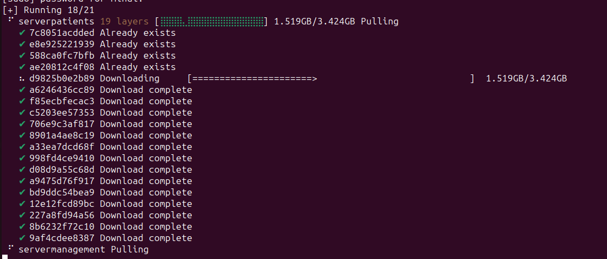

# Distributed Databases Using OracleDB

This documentation serves both as a guide and a report on setting up distributed databases using OracleDB within Docker containers. It aims to provide a step-by-step walkthrough for building the containers, establishing connections, and handling authentication, thereby aiding in the effective deployment and management of distributed Oracle databases.

## Table of Contents

- [Distributed Databases Using OracleDB](#distributed-databases-using-oracledb)
  - [Table of Contents](#table-of-contents)
  - [Build Docker Containers with OracleDB](#build-docker-containers-with-oracledb)
    - [Connecting the Local Database to the Remote One](#connecting-the-local-database-to-the-remote-one)
    - [Handling Unauthorized Errors](#handling-unauthorized-errors)
  - [Authenticating on Container Registry](#authenticating-on-container-registry)
  - [Authenticate to Docker](#authenticate-to-docker)
  - [Compose the Docker Containers](#compose-the-docker-containers)
    - [Docker Images Building](#docker-images-building)
    - [Access Databases Outside of Docker Container](#access-databases-outside-of-docker-container)
      - [Pre-requisites](#pre-requisites)
  - [Resolve Connection Issues](#resolve-connection-issues)
    - [Dealing with `ORA-12526` Errors: Database in Restricted Mode](#dealing-with-ora-12526-errors-database-in-restricted-mode)
      - [Steps](#steps)
      - [Connect to the Management Database](#connect-to-the-management-database)
      - [Connect to the Patients Database](#connect-to-the-patients-database)

---

## Build Docker Containers with OracleDB

### Connecting the Local Database to the Remote One

To set up the connection, run the following command:

```bash
sudo docker-compose up -d
```

:exclamation: **Note**: Running the containers for the first time may lead to an unauthorized error:

```bash
Error response from daemon: unauthorized: authentication required
```

### Handling Unauthorized Errors

If you encounter the above error, it's likely because you need to authenticate. Follow the steps in the next section for guidance.

---

## Authenticating on Container Registry

1. [Sign in](https://login.oracle.com/mysso/signon.jsp) or [create an account](https://profile.oracle.com/myprofile/account/create-account.jspx) on Oracle.com.
2. Verify your email if you just signed up.
3. Navigate to the [Database Container Directory](https://container-registry.oracle.com/ords/f?p=113:4:::NO:4:P4_REPOSITORY,AI_REPOSITORY,AI_REPOSITORY_NAME,P4_REPOSITORY_NAME,P4_EULA_ID,P4_BUSINESS_AREA_ID::).
4. Accept the terms and conditions. [See Image](./assets/image.png)
5. After accepting, you should see the following screen. [See Image](./assets/image-1.png)
6. Open a terminal in the project directory and run:

    ```bash
    sudo docker login container-registry.oracle.com
    ```

7. Pull the OracleDB image:

    ```bash
    sudo docker pull container-registry.oracle.com/database/enterprise:latest
    ```

8. You should see the message **"Login Succeeded"**.

---

## Authenticate to Docker

1. Create an account on [Docker Hub](https://hub.docker.com/signup).
2. Open a terminal and run:

    ```bash
    sudo docker login
    ```

3. Log in using your Docker Hub credentials.
4. You should see the message **"Login Succeeded"**.

---

## Compose the Docker Containers

To bring up the Docker containers, run the following command:

```bash
sudo docker-compose up -d
```

### Docker Images Building

Below is an image illustrating the process of Docker composing:



### Access Databases Outside of Docker Container

In this guide, we'll use **DBeaver** as an example to demonstrate how to connect to Oracle databases running in Docker containers.

#### Pre-requisites

- Two running containers: one for the management database listening on port 7090, and another for the patients database listening on port 7091 (as configured in your `docker-compose` file).

## Resolve Connection Issues

### Dealing with `ORA-12526` Errors: Database in Restricted Mode

If you encounter the error `ORA-12526, TNS:listener: all appropriate instances are in restricted mode`, it means that the Oracle database instance you're trying to connect to is in `RESTRICTED` mode. Follow the steps below to disable this mode:

1. **Connect to the Docker Container**
   - Execute the following command to connect to the Docker container where your Oracle instance is running:

     ```bash
     sudo docker exec -it <container_name> bash
     ```

     For example, to connect to the `distributed-databases-servermanagement-1` container, run:

     ```bash
     sudo docker exec -it distributed-databases-servermanagement-1 bash
     ```

     Similarly, to connect to the `distributed-databases-serverpatients-1` container, execute:

     ```bash
     sudo docker exec -it distributed-databases-serverpatients-1 bash
     ```

3. **Connect to SQL*Plus**
   - Use SQL*Plus to connect to the database as an admin:

     ```bash
     sqlplus / as sysdba
     ```

4. **Check Instance Status**
   - Run the following SQL query to check the status:

     ```sql
     SELECT INSTANCE_NAME, STATUS FROM V$INSTANCE;
     ```

5. **Startup the Database**
   - If the instance is down, start it up:

     ```sql
     STARTUP
     ```

   - If the database is in restricted mode, disable it:

     ```sql
     ALTER SYSTEM DISABLE RESTRICTED SESSION;
     ```

6. **Exit SQL Plus**
   - To exit SQL*Plus, type:

     ```sql
     EXIT;
     ```

7. **Restart the Listener**
   - To apply changes, restart the listener:

     ```bash
     lsnrctl stop
     lsnrctl start
     ```

8. **Check Listener Status**
   - Run `lsnrctl status` to ensure that the instance is now unrestricted.

9. **Test the Connection**
   - Use your client tool, such as DBeaver, to test the connection.

This should resolve the `ORA-12526` issue, allowing for successful connections.

#### Steps

1. **Launch DBeaver**
   - Start the DBeaver application.

2. **Create a New Connection**
   [Create New Connection Image](./assets/dbeaver-new-connection.png)

3. **Select Oracle Database**
   [Select Oracle Database Image](./assets/dbeaver-oracle-db.png)

---

#### Connect to the Management Database

1. **Host**: `localhost`
2. **Database (Service Name)**: `management`
3. **Port**: `7090`
4. **Username**: Enter `sys` and set the role to `SYSDBA`
   [Set Role to SYSDBA Image](./assets/dbeaver-role-sysdba.png)
5. **Password**: `Master2023`
6. **Test Connection**: Ensure everything is set up correctly.
7. **Finish**: Save the connection.

---

#### Connect to the Patients Database

1. **Host**: `localhost`
2. **Database (Service Name)**: `patients`
3. **Port**: `7091`
4. **Username**: Enter `sys` and set the role to `SYSDBA`
   [Set Role to SYSDBA Image](./assets/dbeaver-role-sysdba.png)
5. **Password**: `Master2023`
6. **Test Connection**: Ensure everything is set up correctly.
7. **Finish**: Save the connection.
