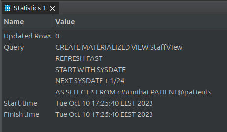
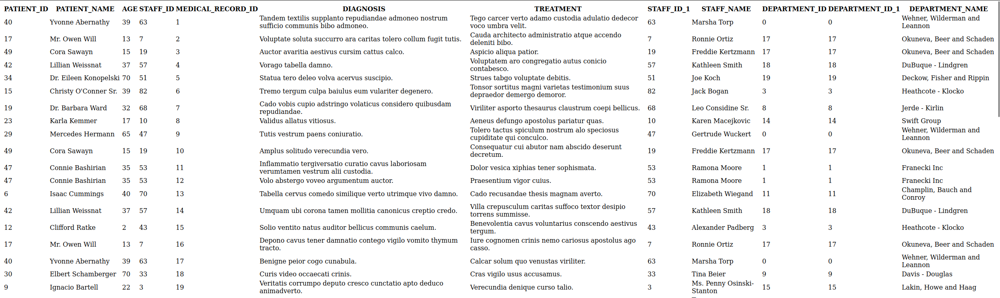

# Hospital Management System Documentation

---

## Table of Contents

1. Introduction
2. ER Diagram
3. Database Design
    - Patient Table
    - Medical Record Table
    - Foreign Key References
4. Database Operations
    - Creating Database Links
    - Understanding Database Link Parameters
    - Testing Database Links
5. Synonyms in Oracle Database
    - Creating Synonyms
    - Usage of Synonyms
    - Benefits of Synonyms
6. Materialized Views in Oracle
    - Procedure for Creating Materialized Views
    - Understanding the Process
    - Refresh Methods
7. Partitioning Techniques
    - Horizontal Partitioning with OracleDB
    - View-Based Partitioning for Medical Records
8. UI Implementation

---

## Introduction

The purpose of this documentation is to provide a detailed overview of the database management system designed for a hospital. We cover various topics, including the Entity-Relationship (ER) Diagram, Database Design, and advanced features like Materialized Views and Partitioning.

---

## ER Diagram


---

## Database Design

### Patient Table

```dbml
Table Patient {
  id integer [primary key]
  name varchar [not null]
  age integer
  staff_id integer
}
```

### Medical Record Table

```dbml
Table MedicalRecord {
  id integer [primary key]
  patient_id integer [not null]
  diagnosis varchar
  treatment varchar
}
```

### Foreign Key References

```dbml
Ref: MedicalRecord.patient_id > Patient.id // many-to-one
Ref: Patient.staff_id > Staff.id // many-to-one
```

---

## Database Operations

### Creating Database Links

#### Overview

In this section, we cover:

1. Creating Database Links
2. Understanding Database Link Parameters
3. Testing Database Links

### 1. Creating Database Links

Database links are created using the `CREATE DATABASE LINK` statement in Oracle. Below are examples of creating two database links, 'patients' and 'management,' connecting to remote databases.

#### Creating a Database Link Named 'patients'

```sql
CREATE DATABASE LINK patients
CONNECT TO system IDENTIFIED BY Master2023
USING '(DESCRIPTION=(ADDRESS=(PROTOCOL=TCP)(HOST=serverpatients)(PORT=1521))(CONNECT_DATA=(SERVICE_NAME=patients)))';
```

- `patients`: Name of the database link.
- `system`: Username to connect to the remote database.
- `Master2023`: Password for the username.
- `serverpatients`: Hostname of the remote database server.
- `1521`: Port number for the database listener.
- `patients`: Service name or SID of the remote database.

#### Creating a Database Link Named 'management'

```sql
CREATE DATABASE LINK management
CONNECT TO system IDENTIFIED BY Master2023
USING '(DESCRIPTION=(ADDRESS=(PROTOCOL=TCP)(HOST=servermanagement)(PORT=1521))(CONNECT_DATA=(SERVICE_NAME=management)))';
```

- `management`: Name of the database link.
- `system`: Username to connect to the remote database.
- `Master2023`: Password for the username.
- `servermanagement`: Hostname of the remote database server.
- `1521`: Port number for the database listener.
- `management`: Service name or SID of the remote database.

### 2. Understanding Database Link Parameters

- **Name**: Choose a unique name for the database link to identify it within your local database.

- **CONNECT TO**: Specify the username to use for connecting to the remote database. Ensure that this user has the necessary privileges.

- **IDENTIFIED BY**: Provide the password for the specified username. Be cautious with password security.

- **USING**: Use the `USING` clause to define the connection details to the remote database. This includes the hostname (HOST), port (PORT), and service name (or SID) of the remote database.

### 3. Testing Database Links

Once you've created database links, you can test their connectivity by running queries that involve tables or objects in the remote database. For example:

```sql
-- Querying to view all existing database links from the DBA_DB_LINKS view
SELECT * FROM DBA_DB_LINKS;
```

#### DBLink query result example


## Synonyms in Oracle Database

In Oracle Database, a synonym is an alias or alternative name for an object, such as a table, view, sequence, or another synonym. Synonyms simplify database access and security by providing a consistent, user-friendly way to reference database objects, especially when those objects are located in different schemas or databases.

### Creating Synonyms

```sql
-- Create a synonym in the Management database for the 'Patient' table in the Patients database
CREATE SYNONYM patient FOR c##mihai.PATIENT@patients;
```

- `patient`: The name of the synonym.
- `c##mihai.PATIENT@patients`: The fully qualified name of the target object, including the schema and database link.

### Creating Synonyms for 'Department' and 'Staff' Tables

```sql
-- Create a synonym in the Patients database for the 'Department' table in the Management database
CREATE SYNONYM department FOR c##mihai.DEPARTMENT@management;

-- Create a synonym in the Patients database for the 'Staff' table in the Management database
CREATE SYNONYM staff FOR c##mihai.STAFF@management;
```

- `department` and `staff`: The names of the synonyms.
- `c##mihai.DEPARTMENT@management` and `c##mihai.STAFF@management`: The fully qualified names of the target objects, including the schema and database link.

### Usage of Synonyms

Once synonyms are created, they can be used in SQL statements just like the original objects they represent. Below are examples of using synonyms in SQL queries:

### Querying the 'Patient' Table Using the 'patient' Synonym

```sql
-- Query the 'Patient' table using the 'patient' synonym
SELECT * FROM patient;
```

### Querying the 'Staff' Table Using the 'staff' Synonym

```sql
-- Query the 'Staff' table using the 'staff' synonym
SELECT * FROM staff;
```

### Benefits of Synonyms

- **Simplified Access**: Synonyms provide a user-friendly way to access database objects without specifying the full object name.

- **Improved Security**: Synonyms can be used to control access to underlying objects and provide an additional layer of security.

- **Flexibility**: If the location or structure of the underlying object changes, you can update the synonym's definition without affecting application code.

- **Schema Abstraction**: Synonyms allow you to abstract the schema details of objects, making it easier to switch between schemas or databases.

- **Reduced Maintenance**: Synonyms simplify maintenance when database objects are moved or renamed.

---

## Materialized Views in Oracle

Materialized views in Oracle databases are a form of snapshots that store the result set of a query as a physical table. These views are useful for improving query performance and data retrieval.

### Procedure for Creating Materialized Views

1. **Create a Materialized View Log (Optional)**

   A materialized view log is a table associated with the base table of the materialized view. It keeps track of changes in the base table, allowing for fast refreshes of the materialized view.

   ```sql
   CREATE MATERIALIZED VIEW LOG ON base_table
   WITH ROWID, PRIMARY KEY, SEQUENCE (columns);
   ```

   Replace `base_table` with the name of your base table and specify the columns you want to track changes for.

2. **Create the Materialized View**

   Create the materialized view using the `CREATE MATERIALIZED VIEW` statement. This statement includes the query that defines the data to be stored in the materialized view.

   ```sql
   CREATE MATERIALIZED VIEW materialized_view_name
   REFRESH [FAST|COMPLETE|FORCE]
   START WITH start_date
   NEXT start_date + interval
   AS
   SELECT * FROM source_table@remote_database;
   ```

   - `materialized_view_name`: Name of the materialized view.
   - `REFRESH`: Specify the refresh method (FAST, COMPLETE, or FORCE).
   - `START WITH` and `NEXT`: Define the refresh schedule.
   - `AS`: The query that retrieves data from the source table, which can be in a remote database.

3. **Refresh the Materialized View**

   Depending on the refresh method chosen, the materialized view will be automatically refreshed based on the defined schedule. You can also manually refresh it using the `DBMS_MVIEW` package.

### Understanding the Process

The process of creating materialized views involves defining the data you want to store, specifying the refresh method, and scheduling the refreshes. Materialized views are particularly useful for storing aggregated data or data from remote databases.

### Refresh Methods

- `FAST`: Updates the materialized view with changes made to the base tables. Requires a materialized view log on the base table.
- `COMPLETE`: Rebuilds the entire materialized view from scratch.
- `FORCE`: Chooses either FAST or COMPLETE refresh based on what is possible. If FAST refresh is possible, it is used; otherwise, COMPLETE refresh is performed.



---

## Partitioning Techniques

Department table by its budget and partitioning medical records through database views. The former employs horizontal partitioning using OracleDB's built-in PARTITION BY RANGE syntax, while the latter utilizes view-based partitioning for medical records based on the initial letter of the diagnosis. These techniques provide efficient ways to manage and query large datasets, aiding in data organization, performance optimization, and resource allocation.

### Horizontal Partitioning with OracleDB

The `Department_Partitioned` table is partitioned based on the budget range.

```sql
CREATE TABLE c##mihai.Department_Partitioned (
    id NUMBER PRIMARY KEY,
    name VARCHAR2(50) NOT NULL,
    budget NUMBER
)
PARTITION BY RANGE (budget) (
    PARTITION Dept_LowBudget VALUES LESS THAN (10000),
    PARTITION Dept_MediumBudget VALUES LESS THAN (50000),
    PARTITION Dept_HighBudget VALUES LESS THAN (MAXVALUE)
);
```


#### SQL for Populating `Department_Partitioned`

If you have an existing `Department` table and wish to populate the partitioned table, execute the following SQL:

```sql
INSERT INTO c##mihai.Department_Partitioned (id, name, budget)
SELECT id, name, budget FROM c##mihai.Department;
```

#### Query for Budget-Based Partition Count

The following query can be used to count the records within each budget partition:

```sql
SELECT 'LowBudget' as BudgetGroup, COUNT(*) FROM c##mihai.Department_Partitioned WHERE budget < 10000
UNION ALL
SELECT 'MediumBudget' as BudgetGroup, COUNT(*) FROM c##mihai.Department_Partitioned WHERE budget BETWEEN 10000 AND 49999
UNION ALL
SELECT 'HighBudget' as BudgetGroup, COUNT(*) FROM c##mihai.Department_Partitioned WHERE budget >= 50000;
```


### View-Based Partitioning for Medical Records

```sql
CREATE VIEW MedicalRecordView AS
SELECT * FROM c##mihai.MedicalRecord
WHERE SUBSTR(diagnosis, 1, 1) BETWEEN 'A' AND 'M'
UNION ALL
SELECT * FROM c##mihai.MedicalRecord
WHERE SUBSTR(diagnosis, 1, 1) BETWEEN 'N' AND 'Z';
```


---

## UI Implementation


