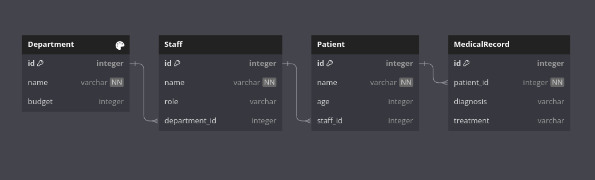
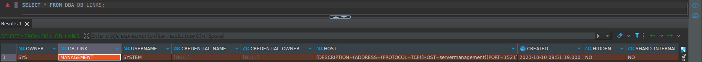
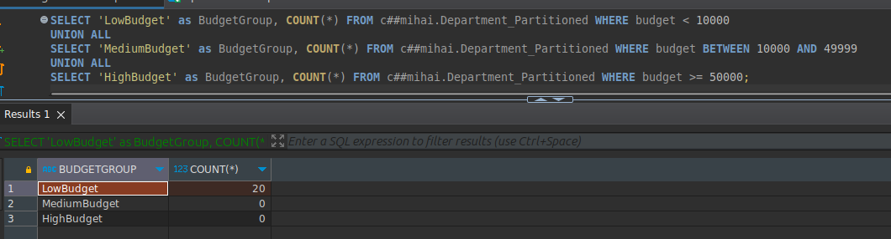
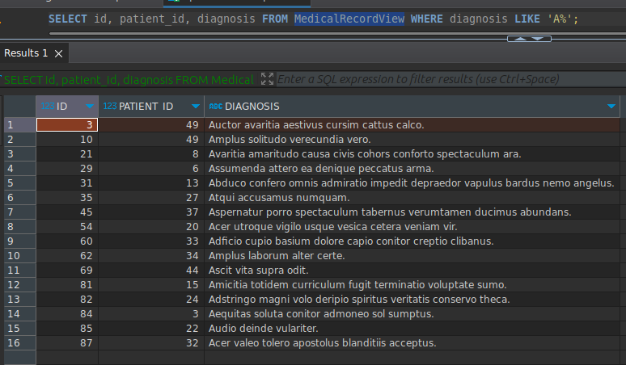

# Baze de date distribuite folosind OracleDB

Această documentație servește atât ca un ghid, cât și ca un raport privind configurarea bazelor de date distribuite folosind OracleDB în containere Docker. Scopul său este de a oferi un ghid pas cu pas pentru construirea containerelor, stabilirea conexiunilor și gestionarea autentificării, ajutând astfel la implementarea și gestionarea eficientă a bazelor de date Oracle distribuite.

## Cuprins

- [Baze de date distribuite folosind OracleDB](#baze-de-date-distribuite-folosind-oracledb)
  - [Cuprins](#cuprins)
  - [Construiți containere Docker cu OracleDB](#construiți-containere-docker-cu-oracledb)
    - [Conectarea bazei de date locale la cea de la distanță](#conectarea-bazei-de-date-locale-la-cea-de-la-distanță)
    - [Manipularea erorilor neautorizate](#manipularea-erorilor-neautorizate)
  - [Autentificarea în registrul de containere](#autentificarea-în-registrul-de-containere)
  - [Autentificare la Docker](#autentificare-la-docker)
  - [Compuneți containerele Docker](#compuneți-containerele-docker)
    - [Construirea imaginilor Docker](#construirea-imaginilor-docker)
    - [Accesarea bazelor de date în afara containerului Docker](#accesarea-bazelor-de-date-în-afara-containerului-docker)
      - [Cerințe prealabile](#cerințe-prealabile)
  - [Instalați biblioteca Oracle Client Library pe Ubuntu](#instalați-biblioteca-oracle-client-library-pe-ubuntu)
  - [Rezolvați problemele de conectare](#rezolvați-problemele-de-conectare)
    - [Dealing with `ORA-12526` Errors: Baza de date în mod restricționat](#dealing-with-ora-12526-errors-baza-de-date-în-mod-restricționat)
      - [Pași](#pași)
      - [Conectați-vă la baza de date de gestiune](#conectați-vă-la-baza-de-date-de-gestiune)
      - [Conectare la baza de date a pacienților](#conectare-la-baza-de-date-a-pacienților)
  - [Ordinea de instalare](#ordinea-de-instalare)
    - [Data Integrity](#data-integrity)
      - [Tabelul personalului](#tabelul-personalului)
      - [**Referințe de chei străine**](#referințe-de-chei-străine)
    - [Patients DB](#patients-db)
      - [Tabel pacienți](#tabel-pacienți)
      - [Tabel de evidență medicală](#tabel-de-evidență-medicală)
      - [Referințe la chei străine](#referințe-la-chei-străine)
  - [Diagramă ER](#diagramă-er)
  - [Documentație privind crearea legăturilor în baza de date](#documentație-privind-crearea-legăturilor-în-baza-de-date)
    - [Management DB](#management-db)
      - [Tabelul Departamentului](#tabelul-departamentului)
      - [Tabel de personal](#tabel-de-personal)
      - [Referințe de chei străine](#referințe-de-chei-străine-1)
    - [Patients DB](#patients-db-1)
      - [Tabel pacienți](#tabel-pacienți-1)
      - [Tabel de evidență medicală](#tabel-de-evidență-medicală-1)
      - [Referințe la chei străine](#referințe-la-chei-străine-1)
  - [Diagramă ER](#diagramă-er-1)
  - [Documentație privind crearea legăturilor în baza de date](#documentație-privind-crearea-legăturilor-în-baza-de-date-1)
    - [Prezentare generală](#prezentare-generală)
    - [1. Crearea legăturilor de baze de date](#1-crearea-legăturilor-de-baze-de-date)
      - [Crearea unei legături de baze de date cu numele "patients](#crearea-unei-legături-de-baze-de-date-cu-numele-patients)
      - [Crearea unei legături de bază de date numită "management](#crearea-unei-legături-de-bază-de-date-numită-management)
    - [2. Înțelegerea parametrilor de legătură cu baza de date](#2-înțelegerea-parametrilor-de-legătură-cu-baza-de-date)
    - [3. Testarea legăturilor din baza de date](#3-testarea-legăturilor-din-baza-de-date)
      - [Exemplu de rezultat al interogării DBLink](#exemplu-de-rezultat-al-interogării-dblink)
  - [Crearea de sinonime](#crearea-de-sinonime)
  - [1. Crearea sinonimelor](#1-crearea-sinonimelor)
    - [Crearea unui sinonim pentru tabelul "Pacient](#crearea-unui-sinonim-pentru-tabelul-pacient)
    - [Crearea de sinonime pentru tabelele "Department" și "Staff](#crearea-de-sinonime-pentru-tabelele-department-și-staff)
    - [Interogarea tabelului "Staff" folosind sinonimul "staff](#interogarea-tabelului-staff-folosind-sinonimul-staff)
  - [3. Avantajele sinonimelor](#3-avantajele-sinonimelor)
  - [Crearea de vizualizări materializate](#crearea-de-vizualizări-materializate)
    - [Procedura](#procedura)
  - [Înțelegerea procesului](#înțelegerea-procesului)
    - [Metode de reîmprospătare](#metode-de-reîmprospătare)
  - [Partiționare](#partiționare)
    - [Partiționarea orizontală cu OracleDB](#partiționarea-orizontală-cu-oracledb)
      - [SQL pentru popularea `Department_Partitioned`](#sql-pentru-popularea-department_partitioned)
      - [Interogare pentru numărul de partiții bazat pe buget](#interogare-pentru-numărul-de-partiții-bazat-pe-buget)
    - [View-Based Partitioning pentru dosare medicale](#view-based-partitioning-pentru-dosare-medicale)
    - [Afișarea faptului că vizualizarea a fost creată cu succes](#afișarea-faptului-că-vizualizarea-a-fost-creată-cu-succes)
  - [UI care prezintă datele din ambele baze de date](#ui-care-prezintă-datele-din-ambele-baze-de-date)

## Construiți containere Docker cu OracleDB

### Conectarea bazei de date locale la cea de la distanță

Pentru a configura conexiunea, rulați următoarea comandă:

```bash
sudo docker-compose up -d
```

:exclamation: **Nota**: Rularea containerelor pentru prima dată poate duce la o eroare neautorizată:

```bash
Răspuns de eroare de la daemon: neautorizat: autentificare necesară
```

### Manipularea erorilor neautorizate

Dacă întâmpinați eroarea de mai sus, este probabil pentru că trebuie să vă autentificați. Urmați pașii din secțiunea următoare pentru a vă ghida.

---

## Autentificarea în registrul de containere

1. [Sign in](https://login.oracle.com/mysso/signon.jsp) sau [create an account](https://profile.oracle.com/myprofile/account/create-account.jspx) pe Oracle.com.
2. Verificați adresa de e-mail dacă tocmai v-ați înregistrat.
3. Navigați la [Database Container Directory](https://container-registry.oracle.com/ords/f?p=113:4:::NO:4:P4_REPOSITORY,AI_REPOSITORY,AI_REPOSITORY_NAME,P4_REPOSITORY_NAME,P4_EULA_ID,P4_BUSINESS_AREA_ID::).
4. Acceptați termenii și condițiile. [Vezi imaginea](./assets/image.png)
5. După acceptare, ar trebui să vedeți următorul ecran. [Vezi imaginea](./assets/image-1.png)
6. Deschideți un terminal în directorul proiectului și rulați:

    ```bash
    sudo docker login container-registry.oracle.com
    ```

7. Trageți imaginea OracleDB:

    ```bash
    sudo docker pull container-registry.oracle.com/database/enterprise:latest
    ```

8. Ar trebui să vedeți mesajul **"Login Succeeded "**.

---

## Autentificare la Docker

1. Creați un cont pe [Docker Hub](https://hub.docker.com/signup).
2. Deschideți un terminal și rulați:

    ```bash
    sudo docker login
    ```

3. Autentificați-vă folosind acreditările Docker Hub.
4. Ar trebui să vedeți mesajul **"Login Succeeded "**.

---

## Compuneți containerele Docker

Pentru a aduce containerele Docker, rulați următoarea comandă:

```bash
sudo docker-compose up -d
```

### Construirea imaginilor Docker

Mai jos este o imagine care ilustrează procesul de compunere Docker:


### Accesarea bazelor de date în afara containerului Docker

În acest ghid, vom folosi **DBeaver** ca exemplu pentru a demonstra cum să ne conectăm la bazele de date Oracle care rulează în containere Docker.

#### Cerințe prealabile

- Două containere care rulează: unul pentru baza de date de management care ascultă pe portul 7090 și altul pentru baza de date a pacienților care ascultă pe portul 7091 (așa cum este configurat în fișierul `docker-compose`).

## Instalați biblioteca Oracle Client Library pe Ubuntu

Trebuie să aveți bibliotecile Oracle Client pe 64 de biți configurate cu ldconfig, sau în LD_LIBRARY_PATH.
Dacă nu aveți Oracle Database pe acest computer, atunci instalați pachetul Instant Client Basic sau Basic Light de la
<https://www.oracle.com/database/technologies/instant-client/linux-x86-64-downloads.html>

1. **Download Instant Client Zip File**:
  Descărcați `instantclient-basic-linux.x64-21.11.0.0.0.0dbru.zip` de pe [site-ul web Oracle](https://www.oracle.com/database/technologies/instant-client/linux-x86-64-downloads.html).

2. **Dezarhivați fișierul**:
  Extrageți conținutul fișierului zip într-un director la alegere. De exemplu, puteți crea un director numit `/opt/oracle/` și să descompuneți pachetul acolo:

    ```bash
    mkdir -p /opt/oracle
    unzip instantclient-basic-linux.x64-21.11.0.0.0.0dbru.zip -d /opt/oracle
    ```

3. Instalați Libaio1

    ```shell
    sudo apt-get update
    sudo apt-get install libaio1 libaio-dev
    ```

4. **Variabile de mediu**:
  Adăugați biblioteca clientului în `LD_LIBRARY_PATH`:

    ```bash
    export LD_LIBRARY_PATH=/opt/oracle/instantclient_21_11:$LD_LIBRARY_PATH
    ```

    Adesea este benefic să puneți această linie în fișierul `.bashrc`, `.zshrc` sau `.profile` pentru a o face permanentă.

5. **Crearea de legături simbolice**:
  Este posibil ca unele aplicații să se aștepte să găsească biblioteci partajate în `/usr/lib`, așa că s-ar putea să fie nevoie să creați legături simbolice:

    ```bash
    sudo ln -s /opt/oracle/instantclient_21_11/libclntsh.so.21.1 /usr/lib/libclntsh.so
    sudo ln -s /opt/oracle/instantclient_21_11/libocci.so.21.1 /usr/lib/libocci.so
    ```

## Rezolvați problemele de conectare

### Dealing with `ORA-12526` Errors: Baza de date în mod restricționat

Dacă întâmpinați eroarea `ORA-12526, TNS:listener: all appropriate instances are in restricted mode`, înseamnă că instanța bazei de date Oracle la care încercați să vă conectați se află în modul `RESTRICTED`. Urmați pașii de mai jos pentru a dezactiva acest mod:

1. **Conectați-vă la containerul Docker**.
   - Executați următoarea comandă pentru a vă conecta la containerul Docker în care se execută instanța Oracle:

     ```bash
     sudo docker exec -it <container_name> bash
     ```

     De exemplu, pentru a vă conecta la containerul `distributed-databases-servermanagement-1`, executați:

     ```bash
     sudo docker exec -it distributed-databases-servermanagement-1 bash

     ```

     În mod similar, pentru a vă conecta la containerul `distributed-databases-server-spatients-1`, executați:

     ```bash
     sudo docker exec -it distributed-databases-server-spatients-1 bash
     ```

2. **Conectează-te la SQL*Plus**
   - Utilizați SQL*Plus pentru a vă conecta la baza de date ca administrator:

     ```bash
     sqlplus / as sysdba
     ```

3. **Verifică starea instanței**
   - Rulați următoarea interogare SQL pentru a verifica starea:

     ```sql
     SELECT INSTANCE_NAME, STATUS FROM V$INSTANCE;
     ```

4. **Demararea bazei de date**
   - Dacă instanța este oprită, porniți-o:

     ```sql
     STARTUP
     ```

   - Dacă baza de date este în modul restricționat, dezactivați-l:

     ```sql
     ALTER SYSTEM DISABLE RESTRICTED SESSION;
     ```

5. **ieșiți din SQL Plus**.
   - Pentru a ieși din SQL*Plus, tastați:

     ```sql
     EXIT;
     ```

6. **Reporniți din nou dispozitivul de ascultare**
   - Pentru a aplica modificările, reporniți dispozitivul de ascultare:

     ```bash
     lsnrctl stop
     lsnrctl start
     ```

7. **Verifică starea ascultătorului**
   - Rulați `lsnrctl status` pentru a vă asigura că instanța este acum nerestricționată.

8. **Testă conexiunea**
   - Utilizați instrumentul client, cum ar fi DBeaver, pentru a testa conexiunea.

Acest lucru ar trebui să rezolve problema `ORA-12526`, permițând conexiuni reușite.

#### Pași

1. **Lansați DBeaver**
   - Porniți aplicația DBeaver.

2. **Crearea unei conexiuni noi**
   Imagine [Create New Connection] (./assets/dbeaver-new-connection.png)

3. **Selectați Oracle Database**
   [Select Oracle Database Image](./assets/dbeaver-oracle-db.png)

---

#### Conectați-vă la baza de date de gestiune

1. **Host**: `localhost`
2. **Bază de date (nume de serviciu)**: `management`
3. **Port**: `7090`
4. **Nume utilizator**: Introduceți `sys` și setați rolul la `SYSDBA`.
   [Set Role to SYSDBA Image](./assets/dbeaver-role-sysdba.png)
5. **Password**: `Master2023`
6. **Test Connection**: Asigurați-vă că totul este configurat corect.
7. **Finish**: Salvați conexiunea.

---

#### Conectare la baza de date a pacienților

1. **Host**: `localhost`
2. **Bază de date (nume de serviciu)**: `patients`
3. **Port**: `7091`
4. **Utilizator**: Introduceți `sys` și setați rolul la `SYSDBA`.
   [Set Role to SYSDBA Image](./assets/dbeaver-role-sysdba.png)
5. **Password**: `Master2023`
6. **Test Connection**: Asigurați-vă că totul este configurat corect.
7. **Finish**: Salvați conexiunea.

## Ordinea de instalare

1. [Creați un utilizator](./oracle-sql/create-user/)
2. [Crearea legăturilor](./oracle-sql/links/)
3. [Creare sinonime](./oracle-sql/synonyms/)
4. [Executați fiecare migrare](./oracle-sql/migrations/)
   1. [Department](./oracle-sql/migrations/management/Department.sql)
   2. [Staff](./oracle-sql/migrations/management/Staff.sql)
   3. [Patients](./oracle-sql/migrations/patients/Patient.sql)
   4. [Medical Record](./oracle-sql/migrations/patients/MededicalRecord.sql)
5. [Create materialized views](./oracle-sql/materialized-views/)

### Data Integrity

În declanșatoarele Oracle, pseudo-recordurile `:NEW` și `:OLD` sunt utilizate pentru a accesa valorile noi și vechi ale coloanelor rândului care este inserat, actualizat sau șters. În cazul unei operații `INSERT`, `:NEW` va conține noile valori care sunt introduse în rând.

Când executați interogarea:

```sql
INSERT INTO INTO c##mihai.Patient (id, name, age, staff_id) VALUES (0, 'Randy Hudson', 56, 60);
```

Valoarea pentru `:NEW.staff_id` în declanșatorul va fi `60`, care este valoarea pe care o introduceți pentru coloana `staff_id`. Declanșatorul va folosi apoi această valoare pentru a căuta în tabelul `staff` pentru a vedea dacă există un membru al personalului cu `id = 60`.

Dacă există un membru al personalului cu `id = 60`, `count_staff` va fi setat la `1` și operațiunea de inserare va continua. În caz contrar, declanșatorul va genera o eroare de aplicație care va indica faptul că a avut loc o încălcare a integrității referențiale.


[Link to data integrity SQL Example](./oracle-sql/data-integrity/CheckStaffId.sql)

#### Tabelul personalului

```dbml
Tabel Personal {
  id integer [primary key]
  name varchar [not null]
  role varchar
  department_id integer
}
```

#### **Referințe de chei străine**

  ```dbml
  Ref: Staff.department_id > Department.id // many-to-one
  ```

---

### Patients DB

#### Tabel pacienți

```dbml
Tabel Pacienți {
  id integer [primary key]
  name varchar [not null]
  age integer
  staff_id integer
}
```

#### Tabel de evidență medicală

```dbml
Tabel MedicalRecord {
  id integer [primary key]
  patient_id integer [not null]
  diagnosis varchar
  treatment varchar
}
```

#### Referințe la chei străine

```dbml
Ref: MedicalRecord.patient_id > Patient.id // many-to-one
Ref: Patient.staff_id > Staff.id // many-to-one
```

## Diagramă ER



## Documentație privind crearea legăturilor în baza de date

Această documentație explică procesul de creare a legăturilor de baze de date într-o bază de date Oracle. Legăturile de baze de date permit comunicarea și accesul la bazele de date la distanță, făcând posibilă interogarea și manipularea datelor în diferite instanțe de baze de date.

### Management DB

#### Tabelul Departamentului

```dbml
Tabel Departament {
  id integer [primary key]
  name varchar [not null]
  budget integer
}
```

#### Tabel de personal

```dbml
Tabel Personal {
  id integer [primary key]
  name varchar [not null]
  role varchar
  department_id integer
}
```

#### Referințe de chei străine

  ```dbml
  Ref: Staff.department_id > Department.id // many-to-one
  ```

---

### Patients DB

Baza de date Oracle creata pentru pacienti.

#### Tabel pacienți

```dbml
Tabel Pacienți {
  id integer [primary key]
  name varchar [not null]
  age integer
  staff_id integer
}
```

#### Tabel de evidență medicală

```dbml
Tabel MedicalRecord {
  id integer [primary key]
  patient_id integer [not null]
  diagnosis varchar
  treatment varchar
}
```

#### Referințe la chei străine

```dbml
Ref: MedicalRecord.patient_id > Patient.id // many-to-one
Ref: Patient.staff_id > Staff.id // many-to-one
```

## Diagramă ER


## Documentație privind crearea legăturilor în baza de date

Această documentație explică procesul de creare a legăturilor de baze de date într-o bază de date Oracle. Legăturile de baze de date permit comunicarea și accesul la bazele de date la distanță, făcând posibilă interogarea și manipularea datelor în diferite instanțe de baze de date.

### Prezentare generală

În acest ghid, vom acoperi: - crearea de legături de tip link de legătură între baze de date:

1. Crearea legăturilor de baze de date
2. Înțelegerea parametrilor legăturilor de baze de date
3. Testarea legăturilor de baze de date

### 1. Crearea legăturilor de baze de date

Legăturile de baze de date sunt create cu ajutorul instrucțiunii `CREATE DATABASE LINK` în Oracle. Mai jos sunt prezentate exemple de creare a două legături de baze de date, "patients" și "management", care se conectează la baze de date la distanță.

#### Crearea unei legături de baze de date cu numele "patients

```sql
CREATE DATABASE LINK patients
CONNECT TO system IDENTIFIED BY Master2023
USING "(DESCRIPTION=(ADRESA=(PROTOCOL=TCP)(HOST=server-pacienți)(PORT=1521)))(CONNECT_DATA=(SERVICE_NAME=pacienți))))";
```

- `pacienți`: Numele legăturii cu baza de date.
- `system`: Nume de utilizator pentru conectarea la baza de date la distanță.
- `Master2023`: Parola pentru numele de utilizator.
- `serverpatients`: Numele de gazdă al serverului bazei de date la distanță.
- `1521`: Numărul portului pentru serverul de ascultare a bazei de date.
- `patients`: Numele serviciului sau SID al bazei de date la distanță.

#### Crearea unei legături de bază de date numită "management

```sql
CREATE DATABASE LINK management
CONNECT TO system IDENTIFIED BY Master2023
USING '(DESCRIPTION=(ADRESA=(PROTOCOL=TCP)(HOST=servermanagement)(PORT=1521)))(CONNECT_DATA=(SERVICE_NAME=management))))'';
```

- `management`: Numele legăturii cu baza de date.
- `system`: Numele de utilizator pentru conectarea la baza de date la distanță.
- `Master2023`: Parola pentru numele de utilizator.
- `servermanagement`: Numele de gazdă al serverului bazei de date la distanță.
- `1521`: Numărul portului pentru serverul de ascultare a bazei de date.
- `management`: Numele serviciului sau SID al bazei de date la distanță.

### 2. Înțelegerea parametrilor de legătură cu baza de date

- **Name**: Alegeți un nume unic pentru legătura cu baza de date pentru a o identifica în cadrul bazei de date locale.

- **CONNECT TO**: Specificați numele de utilizator care trebuie utilizat pentru conectarea la baza de date la distanță. Asigurați-vă că acest utilizator are privilegiile necesare.

- **IDENTIFIED BY**: Furnizați parola pentru numele de utilizator specificat. Fiți precaut cu securitatea parolei.

- **USING**: Utilizați clauza `USING` pentru a defini detaliile de conectare la baza de date la distanță. Aceasta include numele de gazdă (HOST), portul (PORT) și numele serviciului (sau SID) al bazei de date la distanță.

### 3. Testarea legăturilor din baza de date

După ce ați creat legăturile de baze de date, puteți testa conectivitatea acestora executând interogări care implică tabele sau obiecte din baza de date la distanță. De exemplu:

```sql
-- Interogare pentru a vizualiza toate legăturile de baze de date existente din vizualizarea DBA_DB_LINKS
SELECT * FROM DBA_DB_LINKS;
```

#### Exemplu de rezultat al interogării DBLink



## Crearea de sinonime

În Oracle Database, un sinonim este un alias sau un nume alternativ pentru un obiect, cum ar fi o tabelă, o vizualizare, o secvență sau un alt sinonim. Sinonimele simplifică accesul la baza de date și securitatea, oferind un mod coerent și ușor de utilizat de a face referire la obiectele bazei de date, în special atunci când aceste obiecte sunt localizate în scheme sau baze de date diferite.

## 1. Crearea sinonimelor

Pentru a crea un sinonim în Oracle Database, se utilizează instrucțiunea `CREATE SYNONYM`. Mai jos sunt prezentate exemple de creare de sinonime pentru tabelele aflate în baze de date diferite.

### Crearea unui sinonim pentru tabelul "Pacient

```sql
-- Creați un sinonim în baza de date Management pentru tabelul "Patient" din baza de date Patients.
CREATE SYNONYM patient FOR c##mihai.PATIENT@patients;
```

- `patient`: Numele sinonimului.
- `c##mihai.PATIENT@patients`: Numele complet calificat al obiectului țintă, inclusiv schema și legătura cu baza de date.

### Crearea de sinonime pentru tabelele "Department" și "Staff

```sql
-- Creați un sinonim în baza de date "Pacienți" pentru tabelul "Departament" din baza de date "Management".
CREATE SYNONYM department FOR c##

## 2. Utilizarea sinonimelor


Odată create sinonimele, acestea pot fi utilizate în instrucțiuni SQL la fel ca obiectele originale pe care le reprezintă. Mai jos sunt prezentate exemple de utilizare a sinonimelor în interogări SQL:


### Interogarea tabelului "Patient" utilizând sinonimul "patient".


```sql
-- Interogarea tabelului 'Patient' folosind sinonimul 'patient'
SELECT * FROM patient;
```

### Interogarea tabelului "Staff" folosind sinonimul "staff

```sql
-- Interoghează tabelul 'Staff' folosind sinonimul 'staff'.
SELECT * FROM personal;
```

## 3. Avantajele sinonimelor

- **Acces simplificat**: Sinonimele oferă un mod simplu de accesare a obiectelor bazei de date fără a specifica numele complet al obiectului.

- **Securitate îmbunătățită**: Sinonimele pot fi utilizate pentru a controla accesul la obiectele subiacente și pentru a oferi un nivel suplimentar de securitate.

- **Flexibilitate**: Dacă se schimbă locația sau structura obiectului subiacent, puteți actualiza definiția sinonimului fără a afecta codul aplicației.

- **Schema Abstraction**: Sinonimele vă permit să abstractizați detaliile de schemă ale obiectelor, facilitând trecerea de la o schemă la alta sau de la o bază de date la alta.

- **Întreținere redusă**: Sinonimele simplifică întreținerea atunci când obiectele bazei de date sunt mutate sau redenumite.

## Crearea de vizualizări materializate

Vizualizările materializate în bazele de date Oracle sunt o formă de instantanee care stochează setul de rezultate ale unei interogări sub forma unui tabel fizic. Aceste vizualizări sunt utile pentru îmbunătățirea performanței interogărilor și a recuperării datelor.

### Procedura

1. **Crearea unui jurnal de vizualizare materializată (opțional)**

   Un jurnal de vizualizare materializată este un tabel asociat cu tabelul de bază al vizualizării materializate. Acesta ține evidența modificărilor din tabelul de bază, permițând actualizarea rapidă a vizualizării materializate.

   ```sql
   CREATE MATERIALIZED VIEW LOG ON base_table
   WITH ROWID, PRIMARY KEY, SEQUENCE (columns);
   ```

   Înlocuiți `base_table` cu numele tabelului de bază și specificați coloanele pentru care doriți să urmăriți modificările.

2. **Crearea vizualizării materializate**

   Creați vizualizarea materializată folosind instrucțiunea `CREATE MATERIALIZED VIEW`. Această instrucțiune include interogarea care definește datele care urmează să fie stocate în vizualizarea materializată.

   ```sql
   CREATE MATERIALIZED VIEW materialized_view_name
   REFRESH [FAST|COMPLETE|FORCE]
   START WITH start_date
   NEXT start_date + interval
   AS
   SELECT * FROM source_table@remote_database;
   ```

   - `materialized_view_name`: Numele vizualizării materializate.
   - `REFRESH`: Specifică metoda de reîmprospătare (FAST, COMPLETE sau FORCE).
   - `START WITH` și `NEXT`: Definește programul de reîmprospătare.
   - `AS`: Interogarea care recuperează datele din tabelul sursă, care poate fi într-o bază de date la distanță.

3. **Refresh the Materialized View**

   În funcție de metoda de reîmprospătare aleasă, vizualizarea materializată va fi reîmprospătată automat pe baza programului definit. De asemenea, o puteți reîmprospăta manual folosind pachetul `DBMS_MVIEW`.

## Înțelegerea procesului

Procesul de creare a vederilor materializate implică definirea datelor pe care doriți să le stocați, specificarea metodei de reîmprospătare și programarea reîmprospătării. Vizualizările materializate sunt deosebit de utile pentru stocarea datelor agregate sau a datelor din baze de date la distanță.

### Metode de reîmprospătare

- `FAST`: Actualizează vizualizarea materializată cu modificările aduse tabelelor de bază. Necesită un jurnal de vizualizare materializată în tabelul de bază.
- `COMPLETE`: Reconstituie întreaga vizualizare materializată de la zero.
- `FORCE`: Alege fie FAST, fie COMPLETE refresh pe baza a ceea ce este posibil. Dacă este posibilă o reîmprospătare FAST, aceasta este utilizată; în caz contrar, se efectuează o reîmprospătare COMPLETE.


## Partiționare

tabelului Departament după bugetul acestuia și partiționarea fișelor medicale prin intermediul vizualizărilor bazei de date. Prima utilizează o partiționare orizontală folosind sintaxa PARTITION BY RANGE încorporată în OracleDB, în timp ce a doua utilizează o partiționare bazată pe vizualizări pentru fișele medicale pe baza literei inițiale a diagnosticului. Aceste tehnici oferă modalități eficiente de gestionare și interogare a seturilor mari de date, contribuind la organizarea datelor, la optimizarea performanțelor și la alocarea resurselor.

### Partiționarea orizontală cu OracleDB

Tabelul `Department_Partitioned` este partiționat pe baza intervalului bugetar.

```sql
CREATE TABLE c##mihai.Department_Partitioned (
    id NUMBER PRIMARY KEY,
    name VARCHAR2(50) NOT NULL,
    buget NUMBER
)
PARTITION BY RANGE (buget) (
    PARTITION Dept_LowBudget VALUES LESS THAN THAN (10000),
    PARTITION Dept_MediumBudget VALUES LESS THAN THAN (50000),
    PARTITION Dept_HighBudget VALUES LESS THAN THAN (MAXVALUE)
);

```


#### SQL pentru popularea `Department_Partitioned`

Dacă aveți un tabel `Department` existent și doriți să completați tabelul partiționat, executați următorul SQL:

```sql
INSERT INTO c##mihai.Department_Partitioned (id, nume, buget)
SELECT id, name, budget FROM c##mihai.Department;
```

#### Interogare pentru numărul de partiții bazat pe buget

Următoarea interogare poate fi utilizată pentru a număra înregistrările din cadrul fiecărei partiții bugetare:

```sql
SELECT 'LowBudget' as BudgetGroup, COUNT(*) FROM c##mihai.Department_Partitioned WHERE budget < 10000
UNION ALL
SELECT 'MediumBudget' as BudgetGroup, COUNT(*) FROM c##mihai.Department_Partitioned WHERE budget BETWEEN 10000 AND 49999
UNION ALL
SELECT 'HighBudget' as BudgetGroup, COUNT(*) FROM c##mihai.Department_Partitioned WHERE budget >= 50000;
```



### View-Based Partitioning pentru dosare medicale

```sql
CREATE VIEW VIEW MedicalRecordView AS
SELECT * FROM c##mihai.MedicalRecord
WHERE SUBSTR(diagnosis, 1, 1, 1) BETWEEN 'A' AND 'M'
UNION ALL
SELECT * FROM c##mihai.MedicalRecord
WHERE SUBSTR(diagnosis, 1, 1) BETWEEN 'N' AND 'Z';
```



### Afișarea faptului că vizualizarea a fost creată cu succes


## UI care prezintă datele din ambele baze de date


---
